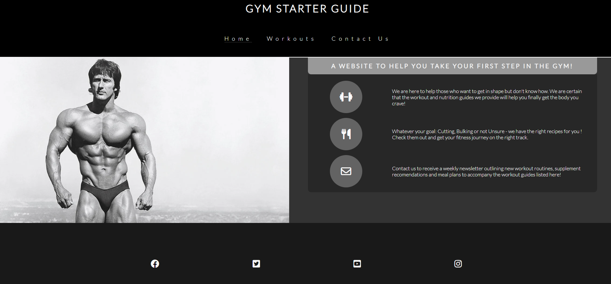
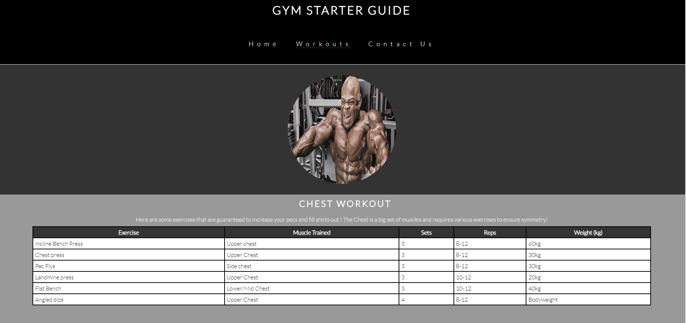
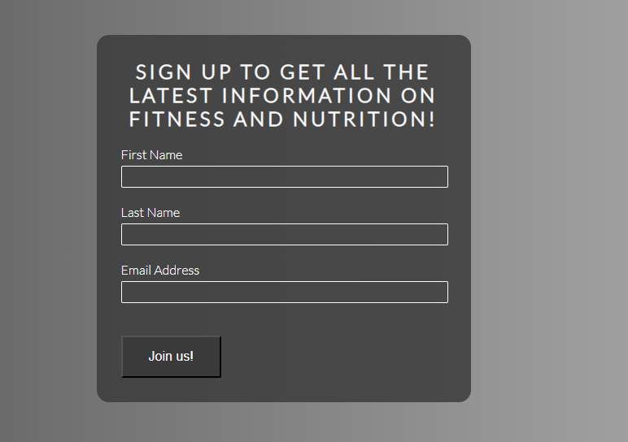
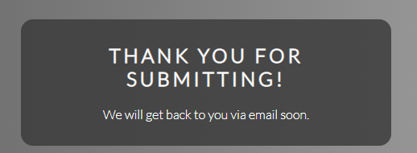

# Gym Starter Guide

One of the hardest things about trying to get in shape is not knowing where to start. We want to change that. Gym Starter Guide is a responsive website that will show you exactly where to begin and how to target each muscle group. We have a great layout of different workouts avaliable and the muscles they train. Whilst this site is designed for demostration, it is very close to my heart. I hope that the information helps others as it has me.

## Features 

We have many features I know that are going to love about the Gym Starter Guide!

### Existing Features

- __Menu Bar__

  - The Navigation bar is highly responsive and avaliable on the Home page, Workouts page and Contact Us Page. It will underline the section you are currently on and underline a section you are hovering over.

- __Home Page__

  - The Home page will be the first thing you see. It includes a great black and white of image of Frank Zane and his incredible physique. This is to attract customers who aspire to get in shape and draw their attention to the possibilities. Adjacent to the image is a section explaining what the website to do Along with some simple icons relevant to the section.

- __The Footer__ 

 - The Footer section gives customers a way to access the social media links of the business. This includes a Facebook, Twitter, YouTube, Instagram link. 

- __The Workouts page__

The workouts page displays circular images of each body type in a column view above the table with the workouts they are for. When hovering over the icons, they will scale up slighlty, making aethesitcally pleasing when finding the workouts you are looking for.

The tables are under the corresponding images for each workout. Contrasting colours 

- __The Contact Us page__

  - This page allows customers to fill out a form with validates that each section is filled and that the email address is a valid. Once Submitted, it will redirect to the submit form

- __Submit__

This page can only be access by submitting valid information via the Contact Us from. Once information has been added, It will display a thank you message

### Features Left to Implement

- A future feature I would like to add is a nutrition page to describe how to calculate macros and ensure you are following a safe diet with the right amount of calories.

## Testing 

- Tested the scaling of the website using developer tools and the emulator screen sizes. All device screens scale properly but when customer dragging the windows, the icons on the home page can become oval shaped.

- Testing scaling on all screens for the workout page. No faults found

- Testing Contact us page. Validation works. Redirect works. No Faults found

- Hovering over workout images scale them up as designed. No faults found

- Initially had an image of Arnold Schwarzenegger as the background for contact form but was unable to scale correctly. Changed to linear gradient color effect instead.

### Validator Testing 

- HTML
  - No errors were returned when passing through the official [W3C validator](https://validator.w3.org/nu/?doc=https%3A%2F%2Fliamd416.github.io%2FP1-Gym-Starter-Guide%2F)
- CSS
  - No errors were found when passing through the official [(Jigsaw) validator](https://jigsaw.w3.org/css-validator/validator?uri=https%3A%2F%2Fliamd416.github.io%2FP1-Gym-Starter-Guide%2F&profile=css3svg&usermedium=all&warning=1&vextwarning=&lang=en)

  ### Unfixed Bugs

  - Some screens also cause footer to have a whitespace underneath, hiding overflow does not resolve. Changing background to match footer color as a temporary fix. Was unable to fix bug by time of submission.

  ## Deployment

  - The site was deployed to GitHub pages. The steps to deploy are as follows: 
  - In the GitHub repository, navigate to the Settings tab 
  - From the source section drop-down menu, select the Master Branch
  - Once the master branch has been selected, the page will be automatically refreshed with a detailed ribbon display to indicate the successful deployment. 

The live link can be found here - https://liamd416.github.io/P1-Gym-Starter-Guide/

## Credits 

### Content

- The Submit form was inspired by code provided by https://learn.codeinstitute.net/dashboard

- The following article helped me with flexbox: https://www.w3schools.com/css/css3_flexbox_container.asp

- The Media Query's were templated from the love-running project: https://liamd416.github.io/love-running/

### Media
- The main bodybuilder image for the home page was taken from: https://www.muscleandfitness.com/flexonline/ifbb/frank-zane-the-thinking-mans-bodybuilder/

- The Icons was taken from font awesome: https://fontawesome.com/

- The Chest Image was taken from: https://www.muscleandfitness.com/flexonline/training/four-week-machine-only-pec-boosting-workouts/

- The Arm Image was taken from: https://www.menshealth.com/fitness/a40794788/biceps-workout-mistakes/

- The shoulder image was taken from: https://www.mensxp.com/health/body-building/39767-which-one-is-better-lateral-raises-with-dumbbells-or-a-cable-pulley.html

- The back image was taken from: https://www.menshealth.com/uk/building-muscle/a759269/10-best-back-exercises-for-building-muscle/

The Image of Arnold Schwarzenegger was taken from: https://manofmany.com/lifestyle/fitness/arnold-schwarzenegger-diet-workout-plan